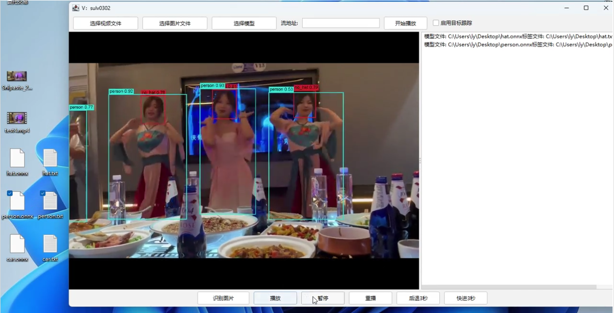

# onnx-inference4j-play

### 🎯 项目简介

`onnx-inference4j-play` 是一个基于 **Java** 和 **ONNX Runtime** 的推理识别工具，提供了直观的可视化窗口，支持多种场景下的模型推理，包括图像、视频、流媒体等。🖼️📹
它具备 **多模型推理**、**目标跟踪**、**动态源切换** 和 **文件拖拽** 功能，适用于各类推理场景，使用体验流畅友好。✨

### 🏗️ 软件架构

- **Java 8**
- **CUDA 11.8** (可以根据需要在 `onnxruntime-gpu` 依赖中适配不同版本)
- 基于 **ONNX Runtime** 和 **OpenCV** 实现图像与视频处理
- 采用 **FlatLaf** 提供现代化的 Swing UI 风格

### 📦 依赖环境

#### **主要依赖**

- **onnxruntime-gpu**: 提供 ONNX 模型的 GPU 推理支持
- **flatlaf**: 用于美化 Swing 界面，提供现代风格
- **opencv**: 负责图像和视频处理操作
- **lombok**: 简化 Java 代码的 Getter/Setter 等样板代码
- **fastjson**: 用于高效的 JSON 序列化与反序列化

### 💻 安装步骤

1. **安装 Java 8**
   项目基于 **Java 8**，请确保系统已安装该版本。
   下载地址：[Java SE Development Kit 8](https://www.oracle.com/java/technologies/javase-jdk8-downloads.html)

2. **安装 CUDA 11.8**
   如果使用 GPU 推理功能，请确保安装 CUDA 11.8，或根据你的 GPU 环境调整 `onnxruntime-gpu` 依赖版本。

3. **克隆代码并构建**
   使用以下命令克隆并构建项目：

   ```
   bash复制代码git clone https://gitee.com/sulv0302/onnx-inference4j-play.git
   cd onnx-inference4j-play
   mvn clean install
   复制项目中的lib目录到打包后的jar包同层级
   ```

### 📝 使用说明

1. **拖拽模型**到模型区域
2. **选择视频、图片**或填写**流地址**
3. 点击**播放按钮**即可开始推理识别

功能特性：

- 支持 **多模型** 推理识别
- **图像识别**、**视频识别** 和 **流地址识别**
- 动态启用或禁用**目标跟踪**
- **实时切换** 图片、视频源，支持 **拖拽文件**

### 🛠 功能概览

- **拖拽文件支持**：用户可以通过拖拽模型、图片、视频文件到界面进行加载
- **模型加载**：支持 ONNX 格式模型，配合标签文件进行推理
- **视频/图像推理**：可加载本地视频、图片或通过流地址进行实时推理
- **目标跟踪**：提供简单的目标跟踪功能，可根据用户需要启用/禁用

### 📚 使用示例

#### 加载模型

用户可以从本地拖拽 **.onnx** 模型文件及对应的 **.txt** 标签文件至界面，或通过“选择模型”按钮加载。

#### 选择视频或图片

点击“选择视频”或“选择图片”按钮，选择文件后即可进行推理，支持的视频格式包括 **mp4**、**avi**、**mkv** 等。

#### 启用目标跟踪

在顶部的 **“启用目标跟踪”** 选项中，勾选或取消勾选以动态启用/禁用目标跟踪功能。

### 🙌 参与贡献

1. Fork 本仓库
2. 新建 Feat_xxx 分支
3. 提交代码
4. 新建 Pull Request

欢迎提交 bug 报告和建议。


视频预览地址
**https://blog.csdn.net/weixin_45598445/article/details/142835487?spm=1001.2014.3001.5502**



